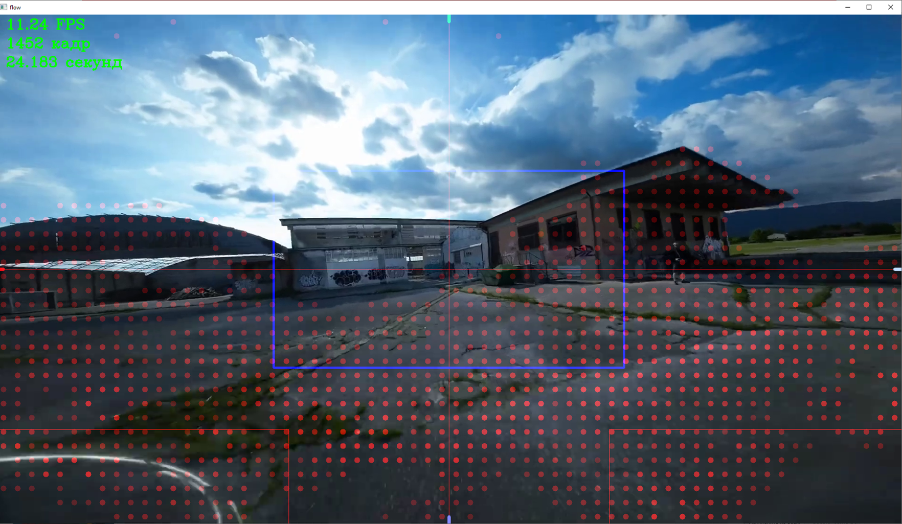
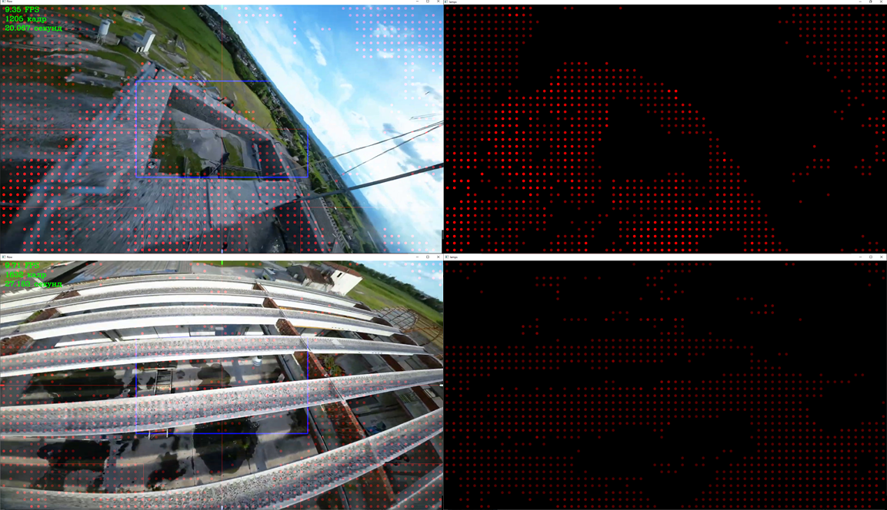

Для просмотра работы алгоритма создана программа pathfinder_viewer.py. Приложены интересные фрагменты полётов и один длинный сложный полёт.
Видео выбирается изменением одной цифры в МЕНЮ НАСТРОЙКИ. Так же в меню можно выбрать стартовую конфигурацию.
В процессе просмотра функционирует клавиатура: Пробел - старт/пауза, 1 - Показать отфильтрованные вектора, 2 - показать опасные точки,
3 - открыть отдельное окно с опасными точками, 4 - показать вектора, не прошедшие фильтрацию. Esc или q - завершить просмотр.
Алгоритм нормально работает и подразумевает использование только при прямолинейном движении в направлении камеры без заметных угловых скоростей или скольжения.
С примерами и подробностями работы так же можно ознакомиться в ПРЕЗЕНТАЦИИ.

